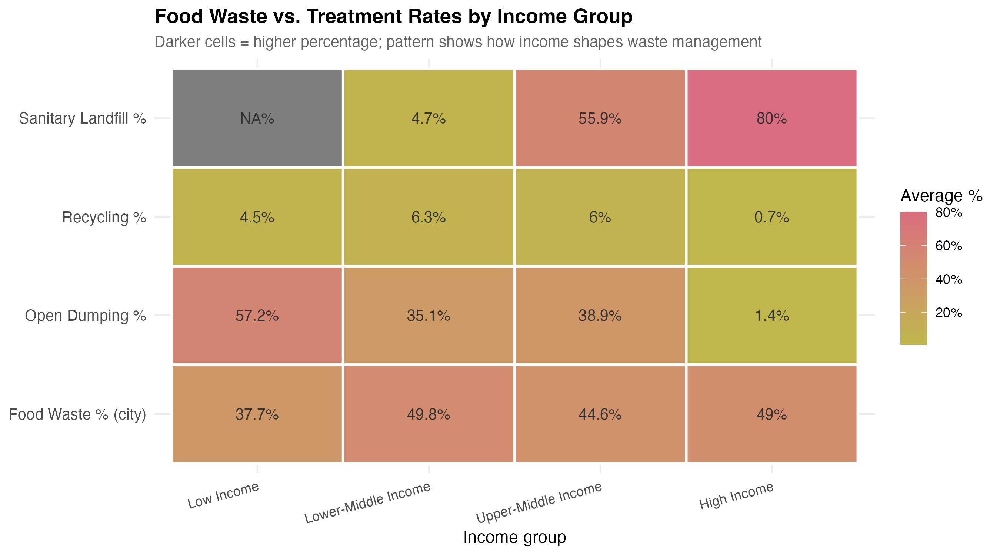

# What a Waste

## Exploring waste composition across income groups and regions

This repository contains materials for the final project for the course [EDS 213: Databases and Data Management](https://ucsb-library-research-data-services.github.io/bren-eds213/). This course is part of the [UCSB Masters in Environmental Data Science](https://bren.ucsb.edu/masters-programs/master-environmental-data-science).

## Purpose

Solid waste is growing faster than cities can manage it, and it is a problem no country has fully solved. What a community throws away and what happens to it varies widely depending on where people live and how wealthy their country is. Understanding these differences requires looking at the data closely.

This project uses the **What a Waste 3.0** database from the World Bank Group to explore the following research question:

> *How does waste composition differ across income groups and regions? And can a country's 
> waste composition predict its recycling or open dumping rates?*

Using a relational database and SQL, it links city-level waste composition data with country-level treatment outcomes, revealing patterns that neither dataset could show alone.



## Repository Structure

```
eds213-final-project/
├── README.md                          
├── waste_data_cleaning.qmd            
├── waste_data_analysis.qmd      
├── waste_data_analysis.sql            
├── requirements.txt                  
├── eds213-final-project.Rproj
├── database/                      
|   └── waste_database.duckdb
├── image/
|   ├── final-proj-schema.png
|   ├── plot1_composition_income.png
|   ├── plot2_composition_region.png
|   ├── plot3_heatmap_treatment.png
|   └── plot4_scatter_prediction.png
└── .gitignore
    └── data/
        ├── raw/
        |   ├── what_a_waste_3_0_city_dataset.xlsx
        |   └── what_a_waste_3_0_country_dataset.xlsx
        └── processed/
            ├── city_cleaned.csv
            └── country_cleaned.csv

```

## Data Access

The `data/` directory is not tracked by version control. It is listed in `.gitignore` because the raw Excel files and the database file are large to store on GitHub. We will need to create this folder structure and download the data yourself before running anything.

This project uses two datasets from the **What a Waste 3.0** global database, published by the World Bank Group.

**City dataset:** One row per city (262 cities across 163 countries). Records waste composition by material type (food, plastic, paper, glass, metal, etc.) and waste treatment percentages (recycling, open dumping, landfill) at the city level.

**Country dataset:** One row per country (217 countries). Records the same waste composition and treatment variables aggregated to the national level.

Both datasets are available for free download from the World Bank Data Catalog:

> World Bank Group. (2024). *What a Waste Global Database*. Retrieved from <https://datacatalog.worldbank.org/search/dataset/0039597/what-a-waste-global-database>

## How to Reproduce This Project

1. Install the R packages listed in `requirements.txt`.
2. Download both Excel files from the World Bank link above.
3. Create a `data/raw/` folder inside the project root and place both Excel files there.
4. Run `waste_data_cleaning.qmd` to produce the cleaned CSV files in `data/processed/`.
5. Create a `data/database/` folder inside the project root.
6. Open DuckDB and run the ingestion steps at the top of `waste_data_analysis.sql` to create `data/database/waste_database.duckdb`.
7. Run the remaining SQL queries in `waste_data_analysis.sql` to explore the data.
8. Run `waste_data_analysis.qmd` to reproduce all visualizations. Output figures are saved to `image/`.

## References and Acknowledgements

World Bank Group. (2024). *What a Waste Global Database*. World Bank Data Catalog. <https://datacatalog.worldbank.org/search/dataset/0039597/what-a-waste-global-database>

Kaza, S., Yao, L., Bhada-Tata, P., & Van Woerden, F. (2018). *What a Waste 2.0: A Global Snapshot of Solid Waste Management to 2050*. World Bank Publications. <https://openknowledge.worldbank.org/handle/10986/30317>

## Course Information

- **Course:** EDS 213: Databases and Data Management
- **Term:** Spring 2026
- **Program:** UCSB Masters in Environmental Data Science

## Teaching Team

- Julien Brun ([jb160@ucsb.edu](mailto:jb160@ucsb.edu))
- Greg Janée ([gjanee@ucsb.edu](mailto:gjanee@ucsb.edu))
- Annie Adams ([aradams@ucsb.edu](mailto:aradams@ucsb.edu))
- Renata Curty ([rcurty@ucsb.edu](mailto:rcurty@ucsb.edu))

**Author:** Aakriti Poudel
